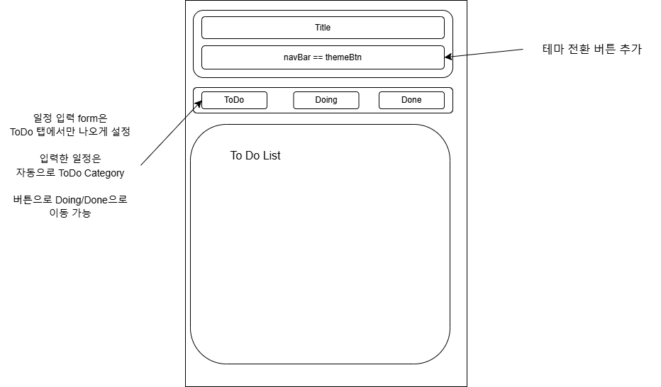
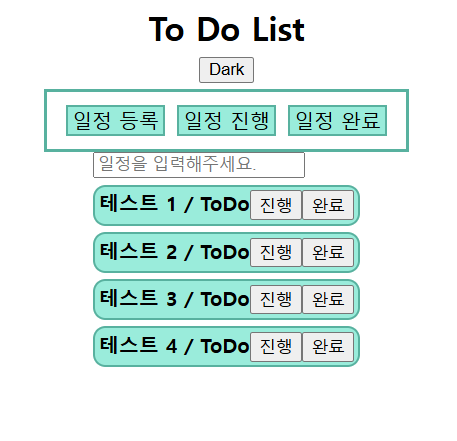
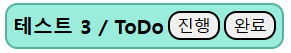
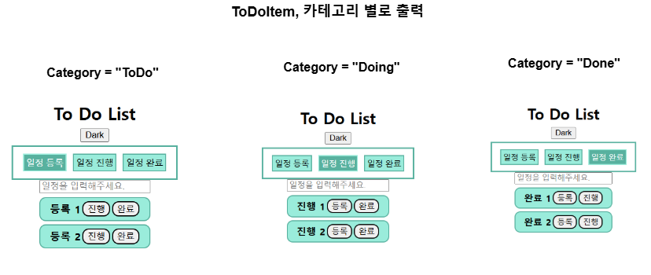

## `To-Do-List`

- Nomadcoders, `React Master class` 2주 Challenge
- `To Do List` 구현 과정

- 강의 URL => **https://nomadcoders.co/react-masterclass**
- 📆 개발 기간: 2024.12.02 ~ 12.04 (총 3일)
    - 마감: 2024.12.05 목요일 오전 6시

---

### 💻 기술 목록
- 고정: `Typescript`, `React`
- CSS Style: `styled-components`
- 상태 관리: `recoil`, `recoil-persist`(`ToDo`, `Category` Backup)
- form: `react-hook-form`
- Publishing: `gh-pages`

---

### 📆 Day 0 작업 요약 (2024.12.01 일요일)
- 월 ~ 수요일까지는 저녁에 편의점 아르바이트를 하는 관계로 <br/>
    개발에 투자할 시간이 좀 부족할 것 같아서 조금 일찍 시작했다.

- **📑 "To Do List 기본 디자인, 일정 등록 구현"**
    - `To Do List`의 레이아웃을 어떤식으로 배치할 지 <br/>
        간단한 도면을 그려보고, 이후 아래와 같이 디자인하였다.

    

    

    - 위와 같이 간단하게 디자인을 설정하고 <br/>
        본격적인 기능 구현 단계에 들어갔다.
    - 일정을 입력하고, 이를 recoil state에 저장해야 하는데
    - 그냥 아무것도 없이 `<form/>`을 다루면 <br/>
        코드가 조금 복잡해질 수 있어서 `React Hook Form`을 사용하였다.
    
    - 일정을 입력하면, 이를 `recoil state`에 저장하고 <br/>
    저장된 일정은 일정 입력 `form` 하단에서 확인 가능하게 작성하였다.

    - 테마 전환 기능은 덤이다...

---

### 📆 Day 1 작업 요약 (2024.12.02 월요일)
- 저번에 하던 거에 이어서 `To Do List` 작업을 진행하였다.

- **📑 "Category 변경 기능 추가"**
    1. **`ToDoItems` Components 구조 수정**
        - `Category` 변경 기능을 업데이트하기 위해선 <br/>
        기존에 `ToDoItems` Component의 코드를 수정할 필요가 생겼다.
        - `ToDoItems`를 `ToDoItem` 컴포넌트만 return하도록 수정하고 <br/>
        기존 `ToDoItems`의 역할을 `<Home />`으로 이관시켰다.

        - `ToDoItem`는 인자로 `{ID, ToDo, Category}` 전달받고 <br/>
        이를 기반으로 `ToDoItem`을 return하는 역할만 하게됐다.

        - 이걸로 전과 비교했을 때, 각 `ToDoItem`의 구분이 용이해졌다.
    
    2. **`Category` 변경하는 버튼 추가**
        - 처음에는 `ToDo / Doing / Done` 순으로 버튼을 추가하려고 했다.

        - `To Do List` App에서 일정을 입력하고, **`등록`** 버튼을 누르면 <br/>
        일정이 등록이 되는데 이때 초기 카테고리는 `ToDo (일정 등록)`이다.

        - 버튼을 통해 `Doing`이나 `Done`으로 카테고리를 변경할 수 있어야 한다.

        - 물론 `Doing/Done`에서 `ToDo`로 변경도 가능해야 한다.

        

        - 위와 같은 형태로 `Category` 변경 버튼을 추가하였다.
        - **`[일정 내용 / 현재 카테고리 / {변경 버튼's}]`**

        - 아무 ToDoItem의 카테고리 변경 버튼을 클릭하면 <br/>
        일정을 저장해둔 `ToDos`에서 해당 `ToDoItem`과 일치하는 <br/>
        `ID` 값을 가진 `ToDo` 요소를 찾아서 `Category` 변경한다.

        - 변경된 것은 버튼 바로 옆의 현재 카테고리에서 확인 가능하다.

---
<br/>

- **📑 "ToDoItem, `Category` 별로 나눠서 보여주는 기능 추가"**

    - `recoil`의 `selector`를 활용해서 기존 `toDoAtoms`에 저장된 <br/>
    `ToDos`를 `Category` 별로 나눈 새로운 배열 `state`를 만들었다.
    - 그리고 현재 탭을 나타내는 별도의 상태를 만들고 <br/>
    현재 탭과 일치하는 카테고리를 가진 `ToDoItem`만 나오도록 <br/>
    업데이트를 진행하였다.

    

---

### 📆 Day 2 작업 요약 (2024.12.03 화요일)

- **📑 "Category, Enum으로 수정, 삭제 기능 추가"**
    -  `ToDoAtoms` 배열에 저장되는 `To Do` 객체의 `Typing`은 아래와 같이 했었다.

	``` ts
	interface I_ToDo {
		ID?: string;
		ToDo?: string;
		Category?: "ToDo"|"Doing"|"Done";
	}
	```
	
	- 기존 방식 그대로 해놔도 문제가 없지만
	- 코드의 가독성을 조금 높이기 위해서 `Categorys`라는 `enum` 추가하였다.
	- 그리고 `I_ToDo`에서 `Category`의 타입을 `Categorys enum`으로 수정했다.

	``` ts
	const enum Categorys {
		ToDo = "ToDo",
		Doing = "Doing",
		Done = "Done"
	};

	interface I_ToDo {
		ID?: string;
		ToDo?: string;
		//Category?: "ToDo"|"Doing"|"Done";
		Category?: Categorys
	};
	```
	
	- `enum`, `열거형`은 `TypeScript`에서 제공하는 기능 중 하나로
	- 관련된 여러 상수들을 모아두는 객체라고 보면 된다.
	- 추후 개발 시의 편의성을 위해서 `enum`으로 Update 하였다. <br/>
		(주로 자동완성이지만...)

---

- **📑 "Project Publishing Start"**

	- 지금까지 개발한 Project 결과물을 외부에서 확인하기 위해서 <br/>
	- 아직 미 완성한 상태지만 `github page`로 배포를 시작하였다.

	- 먼저 `gh-pages` 라이브러리를 설치하고, `package.json` 파일에
	- 아래와 같이 `gh-pages`와 관련된 설정들을 추가하고
	- `Github pages`를 통해 Project 배포를 시작하였다.

	``` json
	//package.json에서 새로 추가한 부분만 발췌
	{
		"scripts": {
			"predeploy": "npm run build",
			"deploy": "gh-pages -d build"
		},
		"homepage": "https://rayched.github.io/[Project Github 저장소 이름]"
	},
	```

---

- **📑 "ToDoAtoms, localStorage에 영구적으로 저장하는 기능 추가"**
    - **`recoil-persist`** 라는 Library를 통해서 <br/>
    `ToDoItem`들을 LocalStorage에 저장하는 것을 넘어서 <br/>
    영속성, 새로고침을 해도 남아있게 할 수 있다.

    - 아래 코드를 `Atoms.ts` 파일에 추가하는 것으로 <br/>
    손쉽게 `ToDoItem`을 LocalStorage에 저장할 수 있다.

    ``` ts
    import {recoilPersist} from "recoil-persist";

    const {persistAtom} = recoilPersist({
        key: "ToDosLocal", //key 값은 원하는 값을 넣으면 된다.
        storage: localStorage
    });

    export const ToDoAtoms = atom<I_ToDo[]>({
        key: "ToDoOrigin",
        default: [],
        effects_UNSTABLE: [persistAtom] //New
    });
    ```

    - `AddToDo` Form에서 입력한 `To Do` 정보를 `ToDoAtoms`에 저장한다.
    - 그리고 `recoilPersist` Hook을 통해서 저장한 정보를 <br/>
    `localStorage`에 영구적으로 저장할 수 있다.

    - 오늘 처음배운 기능이라 적용만 해두기로 했다.
    - 상세한 원리는 챌린지가 끝나고 나서 알아보자...

---

### 📆 Day 3 작업 요약 (2024.12.04 수요일)

- **📑 "커스텀 Category 추가 기능 업데이트(localStorage 저장 포함)"**
	- 앞에서 사용자가 추가한 `ToDo`를 `localStorage`에 저장하는 <br/>
		기능을 업데이트 하였다.
	- 이제  사용자 정의 카테고리를 추가하는 기능을 만들어야 한다.
	
	- 우선 `Category`의 형태를 `{key, value}`로 수정하고
	- `interface I_Categories` 추가해서 `Typing`까지 하였다.
	
	- 그리고 `I_ToDo`의 `Category props`를 아래와 같이 <br/>
		`I_Categories`의 `key`라는 속성으로 `Typing`하였다.

	``` ts
	//Atoms.ts
	interface I_Categories {
		/*개발 편의를 위해 
		이름을 수정하였음.*/
		key?: string;
		value?: string;
	};
	
	interface I_ToDo {
		ID?: string;
		ToDo?: string;
		//Category?: Categorys
		Category?: I_Categories["key"];
	};
	```
	
	- `To Do List` App에서 사용자가 커스텀 카테고리를 추가하면 <br/>
		`ToDoItem`에도 커스텀 카테고리로 넘어가는 버튼이 생겨야 한다.
	* 이를 위해서 `enum`으로 설정한 `Category`들을 배열의 형태로 변경하였다.

	``` ts
	//Atoms.ts
	/*
	const enum Categorys {
		ToDo = "ToDo",
		Doing = "Doing",
		Done = "Done"
	};
	*/
	const {persistAtom: saveCategories} = recoilPersist({
		key: "CategoryLocal",
		storage: localStorage
	});

	const DefaultCategory: I_Categories[] = [
		{ key: "ToDo", value: "등록"},
		{ key: "Doing", value: "진행"},
		{ key: "Done", value: "완료"}
	];

	const CategoryAtom = atom({
		key: "CategoriesBackup",
		default: DefaultCategory,
		effects_UNSTABLE: [saveCategories]
	});
	```

- 위와 같이 `Category`와 관련된 코드들을 추가하고
- `<ToDoItem />`에서 카테고리 변경 버튼 쪽 코드와 <br/>
	`<Home />`에서 카테고리 탭 변경 버튼 코드를 전부 수정하였다.

	``` tsx
	function ToDoItem(){
		/*
		return (
			<div>
				{Category === Categorys.ToDo ? null : 
				<CategoryBtn name="ToDo" onClick={ChangeCategory}>
					등록
				</CategoryBtn>}
				//[진행], [완료] 버튼 코드...
			</div>
		);
		*/
		const Categories = useRecoilValue(CategoryAtom);
		
		return (
			<div>
				{
					Categories.map((todo) => {
						return (
							<CategoryBtn>{todo.value}</CategoryBtn>
						);
					})
				}
			</div>
		)
	}
	```
	
	- 위와 같이 `Array.map()` 함수를 통해 `CategoryAtom`에 저장된 <br/>
		모든 카테고리에 대응하는 버튼을 만들도록 코드를 수정하였다.

	- 이제 사용자가 커스텀 카테고리를 추가하면
	- 커스텀 카테고리의 탭으로 넘어가는 버튼과 
	- `ToDo`를 해당 카테고리로 넘기는 버튼이 자동으로 추가된다.

---

- **📑 "To Do List 디자인 조정 작업"**


